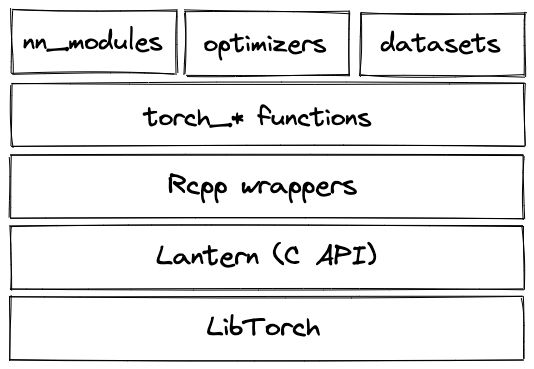

```{r setup, include=FALSE}
library(learnr)
library(torch)
library(luz)
library(torchvision)
library(tidyverse)
library(tsibble)
library(tsibbledata)
library(lubridate)
library(fable)
library(feasts)
library(zeallot)

knitr::opts_chunk$set(echo = FALSE)
```

## Bienvenu(e)s!

Aujourd'hui, on va vous montrer comment faire de l'apprentissage automatique avec `torch` et son API de haut niveau, `luz`.

### `torch`

[`torch`](http:/torch.mlverse.org) torch est un cadre natif R pour le calcul rapide de tableaux avec différenciation automatique et de riches fonctionnalités de réseaux neuronaux.

`torch` est implémenté en R et C++, tout en déléguant à LibTorch pour les opérations de plus bas niveau.



### `luz`

Ce que `keras` est à `tensorflow` -- une API de haut niveau qui uniformise et instrumente l'apprentissage -- `luz` est à `torch`. Alors que tout peut être accompli avec `torch` seul, `luz` peut être d'une aide énorme, en tant que

-   fournissant une interface déclarative à l'apprentissage, assez semblable à *keras*

-   éliminant du code générique

-   surveillant des métriques souvent utilisées en science de données, et permettant aux utilisateurs d'en définir ses propres mesures

-   fournissant un ensemble de *rappels* prêts à l'emploi afin de contrôler l'apprentissage, sauvegarder l'état du modèle, etc.

-   définant une interface simple pour créer vos propres rappels

### Écosystème

-   [torch](https:/github.com/mlverse/torch)

-   [luz](https:/github.com/mlverse/luz)

-   [torchvision](https:/github.com/mlverse/torchvision)

-   [torchdatasets](https:/github.com/mlverse/torchdatasets)

-   [tabnet](https:/github.com/mlverse/tabnet)

-   ... et plus encore!

### Nos objectifs pour aujourd'hui

1.  Comprendre et utiliser les tenseurs `torch` et les modules de réseaux neuronaux ; comprendre et appliquer la différenciation automatique.

2.  Utiliser `luz` pour entraîner des réseaux neuronaux de manière déclarative.

3.  Démarrer avec la prévision des séries temporelles avec `torch`.

### Prerequisites

Pour suivre ce tutoriel, vous devez installer les paquets suivants :

```{r}
library(torch)
library(luz)
library(torchvision)

library(learnr)
library(dplyr)
```

## `torch` tenseurs, modules, and autograd

### Tenseurs

#### Créer des tenseurs

##### Méthode 1 : A partir des valeurs R

Les tenseurs peuvent être créés directement à partir de valeurs R en utilisant torch_tensor(). En option, nous pouvons définir les attributs du tenseur, y compris le type de données, le dispositif sur lequel il vit, et plus encore.

Ici, nous créons des tenseurs unidimensionnels (donc, des vecteurs):

```{r, eval=FALSE, echo=TRUE}
torch_tensor(1)
torch_tensor(1, dtype = torch_int())
torch_tensor(1, device = "cuda")

torch_tensor(c(1, 2, 3)) # tenseur flottant
```

Des tenseurs bidimensionnels peuvent être créés à partir de matrices R.

```{r, eval=FALSE, echo=TRUE}
torch_tensor(matrix(1:9, ncol = 3)) # tenseur entier
torch_tensor(matrix(1:9, ncol = 3))$to(dtype = torch_float()) # convertir en flottant

torch_tensor(matrix(1:9, ncol = 3, byrow = TRUE))
```

Des tenseurs de plus haute dimension peuvent être créés à partir de tableaux R, mais il est normalement plus facile d'utiliser les fonctions de création en masse.

##### Méthode 2 : Fonctions de création en masse.

Des tenseurs multidimensionnels suivant un certain modèle définissable sont créés en passant en tant qu'argument la dimensionnalité souhaitée. Quelques exemples (il en existe d'autres) :

```{r, eval=FALSE, echo=TRUE}
torch_zeros(c(3, 3))
torch_rand(c(3, 3))

```

Un autre type de fonction souvent utilisé consiste à spécifier la plage souhaitée :

```{r, eval=FALSE, echo=TRUE}
torch_arange(1, 9)
torch_logspace(start = 0.1, end = 1.0, steps = 5)
```

#### Reconversion en R

Les tenseurs sont reconvertis en R en utilisant `as.numeric()`, `as.matrix()`, ou `as.array()`:

```{r, eval=FALSE, echo=TRUE}
torch_tensor(2) %>% as.numeric()

torch_ones(c(2, 2)) %>% as.matrix() 

torch_ones(c(2, 2, 2)) %>% as.array() 
```

#### Opérations sur les tenseurs

Il y a un grand nombre d'opérations qui peuvent être effectuées sur les tenseurs. En général, il existe une paire de fonction (non associée à un objet) et de méthode correspondante ("appartenant" à une instance de tenseur) qui font la même chose :

```{r, eval=FALSE, echo=TRUE}
t1 <- torch_tensor(c(1, 2, 3))
t2 <- torch_tensor(c(1, 2, 3))

torch_add(t1, t2)
t1$add(t2)
```

Dans les deux cas, les tenseurs originaux ne sont pas modifiés du tout; par contre, un nouvel objet est créé. Normalement, vous alliez simplement l'assigner à une nouvelle variable :

```{r, eval=FALSE, echo=TRUE}
t3 <- t1$add(t2)

t1
t3
```

Dans les rares cas où vous devez modifier le tenseur original, vous pouvez utiliser les variantes trait de soulignement correspondantes:

```{r, eval=FALSE, echo=TRUE}
t1$add_(t2)
t1
```

Voici quelques-unes des nombreuses opérations matricielles disponibles. `$mul()` effectue une multiplication par éléments; `$matmul()` effectue une multiplication matricielle; `$dot()` calcule le produit scalaire :

```{r, eval=FALSE, echo=TRUE}
t1$mul(t2)

# fonctionnent tous les deux(en torch, il n'ya pas de concept de vecteur ligne vs colonne)
t1$matmul(t2)
t1$t()$matmul(t2)

t1$dot(t2)
```

Vous pouvez voir que `torch` ne fait pas de distinction entre les vecteurs ligne et colonne. Ci-dessus, `$t()` transpose le vecteur `t1`, mais la multiplication matricielle fonctionnera sans.

#### Remodeler des tenseurs

Souvent, vous aurez besoin de remodeler un tenseur. Parmi les opérations les plus courantes, citons `$squeeze()` et `$unsqueeze()`. La première supprime une dimension singleton à la position spécifiée (où singleton signifie que la dimension est de longueur 1) :

```{r, eval=FALSE, echo=TRUE}
t1 <- torch_randn(c(1, 2, 3, 4))
t1

t1$squeeze(1)
```

Le dernier, par contre, ajoute une dimension singleton:

```{r, eval=FALSE, echo=TRUE}
t1$unsqueeze(4)
```

Cela ne fonctionne que pour les dimensions singleton. `$view()`, en revanche, fonctionne pour un remodelage arbitraire, à condition que le nombre d'éléments le permette. `t1`, ci-dessus, à 24 valeurs, qui pourraient aussi bien être arrangées en 6x4 ou 1x24 :

```{r, eval=FALSE, echo=TRUE}
t2 <- t1$view(c(6, 4))

t3 <- t1$view(24)

```

En fait, `$view()` ne crée pas réellement un tenseur nouveau; au lieu de cela, cette méthode arrange pour que la nouvelle référence se réfère toujours au même emplacement en mémoire, et stocke juste quelques métadonnées qui indiquent à `torch` comment interpréter les octets respectifs. Il y a des situations où `$view()` ne peut pas être utilisé; dans ce cas, vous pouvez toujours utiliser `$reshape()` à sa place. Contrairement à `$view()`, `$reshape()` fera une copie physique si nécessaire.

#### Indexation et découpage en tranches

L'indexation dans `torch` est basée sur 1, tout comme en R en général. Et tout comme daens R, les dimensions singleton seront abandonnées - sauf si vous spécifiez`drop = FALSE`:

```{r, eval=FALSE, echo=TRUE}
t1

t1[ , 1, , ]
t1[ , 1, , , drop = FALSE]

```

Les plages de valeurs ("tranches") se peuvent accéder en utilisant le point-virgule:

```{r, eval=FALSE, echo=TRUE}
t1[1, 1, 1:2, ]
t1[1, 1, 1:2, , drop = FALSE]
```

Un raccourci qui n'existe pas en R (où la même syntaxe a une sémantique différente), l'indice -1 est utilisé pour faire référence au dernier élément d'une dimension singleton:

```{r, eval=FALSE, echo=TRUE}
t2 <- torch_tensor(1:17)
t2[-1] 
```

#### Diffusion ("broadcasting")

Dans `torch`, les tenseurs peuvent être diffusés. Le principe est le même que lorsque, en R, on ajoute un scalaire à chaque élément d'un vecteur. Mais ça va plus loin que cela. Nous n'avons pas le temps d'expliquer les règles en détail, mais nous montrons quelques exemples. (Ainsi qu'un énoncé bref des règles, pour que vous puissiez y revenir plus tard.)

Ici, nous "ajoutons" une matrice et un vecteur, ce qui fait que le vecteur est ajouté à chaque ligne de la matrice. Ceci n'est possible que parce que `t2` a une dimension singleton à l'avant.

```{r, eval=FALSE, echo=TRUE}
t1 <- torch_randn(c(3,5))
t2 <- torch_randn(c(1,5))

t1$add(t2)
```

L' exemple suivant est similaire, mais il implique une opération supplémentaire du côté de `torch` : `t2` est d'abord virtuellement étendu à la taille 1x5 (une dimension singleton est ajoutée devant). Ensuite, les choses se passent comme ci-dessus.

```{r, eval=FALSE, echo=TRUE}
t1 <- torch_randn(c(3,5))
t2 <- torch_randn(c(5))

t1$add(t2)
```

Comme dernier exemple, nous voyons ici à la fois l'ajout virtuel d'une dimension singleton (à `t1`) et la "réutilisabilité" des dimensions singleton montrée avant. Cette dernière idée est utilisée deux fois, pour `t1` ainsi que pour `t2`.

#### Annexe: Règles de diffusion

    # 1 Nous alignons les formes du tableau, en commençant par la droite.
      
      # Exemple

      # t1, forme:     8  1  6  1
      # t2, forme:        7  1  5
      

    # 2 En regardant à partir de la droite, les tailles le long des axes alignés doivent soit correspondre exactement, soit l'une d'entre elles doit être égale à 1.
    # Dans ce dernier cas, le tenseur à une dimension est diffusé vers le plus long.

      # Exemple: Cela se produit dans la dernière (pour t1) ainsi que dans l'avant-dernière dimension (pour t2).

      # t1, forme:     8  1  6  5
      # t2, forme:        7  6  5


    # 3 Si à gauche, l'un des tableaux a un axe supplémentaire (ou plus d'un),
    l'autre est virtuellement étendu pour avoir une taille de 1 à cet endroit.


    #  Ensuite, la diffusion se fera comme indiqué dans (2).

      # Exemple: Ça se passe dans la dimension la plus à gauche de t1. D'abord,   il y a une expansion virtuelle

      # t1, forme:     8  1  6  1
      # t2, forme:     1  7  1  5

      # et ensuite, la diffusion se produit:
      
      # t1, forme:     8  1  6  1
      # t2, forme:     8  7  1  5

#### Exercice: Tenseurs

Dans les exercices suivants, essayez de traduire le code R en opérations équivalentes `torch`.

1.  Créez deux tenseurs représentant respectivement une matrice et un vecteur :

```{r tensors1, exercise=TRUE, exercise.eval=TRUE}
# une matrice
m1 <- matrix(1:32, ncol = 8, byrow = TRUE)

# en réalité, un vecteur
m2 <- matrix(1:8, ncol = 1)

m1
m2
```

```{r tensors1-hint}
t1 <- torch_tensor(matrix(1:32, ncol = 8, byrow = TRUE))
t2 <- torch_tensor(1:8)

t1
t2
```

2.  Multipliez les matrices, faites la somme de tous les éléments et prenez la racine carrée:

```{r tensors2, exercise=TRUE, exercise.eval=TRUE}
(m1 %*% m2)^2 %>% sum() %>% sqrt()
```

```{r tensors2-hint}
t1$matmul(t2)$square()$sum()$to(dtype = torch_float())$sqrt()
```

[Notez comment nous avons besoin de convertir en flottant afin d'être en mesure d'appeler `torch_sqrt()`.]

3.  Multiplier chaque ligne de `m1` par le vecteur `m2` (par éléments) :

```{r tensors3, exercise=TRUE, exercise.eval=TRUE}
m1 * rbind(t(m2), t(m2), t(m2), t(m2))
```

```{r tensors3-hint}
t1 * t2
```

[Notez comment la diffusion s'occupe de la duplication pour nous. Aussi, notez comment aucune transposition n'est nécessaire, car `torch` n'a aucun concept de vecteurs de ligne vs. vecteurs de colonne.]

4.  Transposez la matrice `m1`, et calculez les sommes des colonnes. (Cela devrait donner 4 valeurs).

```{r tensors4, exercise=TRUE, exercise.eval=TRUE}
t(m1) %>% apply(2, sum)
```

```{r tensors4-hint}

t1$t()$sum(dim = 1)
```

[Notez comment l'application de la somme sur la dimension 1 (et non 2) réduit les rangées. Essayez de le voir comme ceci : Étant donné un indice dans les dimensions, en R, nous pensons "grouper par". Dans `torch`, on pense "réduire".]

5.  Normalisez `m1` en soustrayant la moyenne et en divisant par l'écart-type.

```{r tensors5, exercise=TRUE, exercise.eval=TRUE}
(m1 - mean(m1)) / sd(m1)
```

```{r tensors5-hint}
t1 <- t1$to(dtype = torch_float())
(t1 - t1$mean()) / t1$std()
```

Tout comme `torch_sum()`, `torch_mean()` et`torch_std()` ont besoin que leur entrée soit de type float.

### Différenciation automatique avec autograd

#### Comment ça marche

`torch` autograd fournit de la différenciation automatique pour les opérations exécutées sur les tenseurs. Pour que cela se produise, le tenseur "source" (ou "feuille", comme `torch` l'appelle) - celui par rapport auquel nous voulons que les dérivés soient calculés - doit être créé avec `requires_grad = TRUE`. Appelons-le `a`:

```{r, eval=FALSE, echo=TRUE}
a <- torch_tensor(matrix(1:4, ncol = 2, byrow = TRUE), dtype = torch_float(), requires_grad = TRUE)

```

Dans cet exemple, `c`, la sortie, dépend de `a` via `b`:

```{r, eval=FALSE, echo=TRUE}
b <- a$mul(2)
c <- b$sum()
```

Jusqu'à présent, aucun dérivé n'a encore été calculé. Mais `torch` sait ce qu'il faut faire si nous le lui demandons. Plus précisément, il connaît les opérations concrètes pour lesquelles il va falloir les dérivées:

```{r, eval=FALSE, echo=TRUE}
c$grad_fn
b$grad_fn
```

Pour les faire calculer, appelez `$backward()`sur le tenseur de sortie:

```{r, eval=FALSE, echo=TRUE}
c$backward()
```

Maintenant, le gradient de `c` par rapport à `a` peut être trouvé dans le champ `$grad` de `a`.

```{r, eval=FALSE, echo=TRUE}
a$grad
```

Lorsque nous mettons à jour un tenseur "feuille", par exemple dans l'optimisation, nous ne voulons pas que `torch` enregistre cette opération pour le calcul ultérieur des dérivés. Dans ces cas, nous devons lui dire d'exempter l'opération en question du processus:

```{r, eval=FALSE, echo=TRUE}
     
with_no_grad( {
  a$sub_(0.1 * a$grad)
})

a
```

#### Minimiser une fonction avec autograd

Nous pouvons utiliser autograd pour minimiser une fonction. Nous définissons un paramètre pour contenir $\mathbf{x}$. Ensuite, dans une boucle, nous évaluons la fonction à la valeur courante de $\mathbf{x}$, calculons le gradient, et soustrayons une fraction du gradient de $\mathbf{x}$.

```{r, eval=FALSE, echo=TRUE}

# fonction à minimiser
f <- function(x) x^2 - 7

# on démarre à x = 11
param <- torch_tensor(11, requires_grad = TRUE)

# taux d'apprentissage : fraction du gradient à soustraire
lr <- 0.1

for (i in 1:num_iterations) {
  
  # appeler la fonction sur la valeur du paramètre actuel

  # calculer le gradient de la valeur par rapport au paramètre

  # mettre à jour le paramètre

}
```

Dans l'exercice, il vous est demandé de compléter les pièces manquantes.

#### Exercice : Minimisation de fonction

Remplissez les lignes marquées "à compléter". Une fois le code exécuté, expérimentez avec le taux d'apprentissage et comparez les résultats. Quel est un bon taux d'apprentissage pour ce problème?

```{r autograd, exercise=TRUE, exercise.eval=TRUE}
# fonction à minimiser
f <- function(x) x^2 - 7

# on démarre à x = 11
param <- torch_tensor(11, requires_grad = TRUE)

# taux d'apprentissage : fraction du gradient à soustraire
lr <- 0.1

for (i in 1:10) {
  
  cat("Iteration: ", i, "\n")
  
  # appeler la fonction sur la valeur du paramètre actuel
  value <- 777 # à compléter
  cat("Value is: ", as.numeric(value), "\n")
  
  # calculer le gradient de la valeur par rapport au paramètre
  # à compléter
  # décommentez la ligne suivante quand vous êtes prêt
  # cat("Gradient is: ", as.matrix(param$grad), "\n")
  
  # mettre à jour le paramètre
  # envelopper dans with_no_grad()
  with_no_grad({
    # soustraire une fraction du gradient du paramètre
    # à compléter
    
    # mettre à zéro à chaque itération (sinon, il y aurait accumulation)
    # à compléter
  })
  
  cat("After update: Param is: ", as.matrix(param), "\n\n")
  
  if (abs(-7 - as.numeric(value)) < 0.00005) break
}
```

```{r autograd-hint}
f <- function(x) x^2 - 7

param <- torch_tensor(11, requires_grad = TRUE)

lr <- 0.5

for (i in 1:10) {
  
  cat("Iteration: ", i, "\n")
  
  value <- f(param)
  cat("Value is: ", as.numeric(value), "\n")

  value$backward()
  cat("Gradient is: ", as.matrix(param$grad), "\n")
  
  with_no_grad({
    param$sub_(lr * param$grad)
    param$grad$zero_()
  })
  
  cat("After update: Param is: ", as.matrix(param), "\n\n")
  
  if (abs(-7 - as.numeric(value)) < 0.00005) break
}

```

### Modules et optimiseurs

Bien que tout puisse être fait avec les tenseurs et autograd seuls, coder un grand réseau neuronal de cette manière serait une tâche assez lourde. Heureusement, ce n'est pas nécessaire. D'une part, torch fournit un ensemble riche de modules de réseaux neuronaux qui cachent la logique des couches; et d'autre part, ses optimiseurs encapsulent des algorithmes d'optimisation connus pour leur efficacité dans l'apprentissage profond.

#### Modules de réseaux neuronaux

`torch` utilise le terme module pour les couches individuelles (par exemple, couche , couche convolutive ...) ainsi que pour les modèles, c'est-à-dire les réseaux neuronaux. La logique ici est que les modules sont composables; un modèle/module n'est rien d'autre qu'une composition de modules plus petits, qui peuvent à nouveau contenir des modules encore plus petits, etc.

##### Module linéaire

Voici une transformation affine, codée manuellement:

```{r, eval=FALSE, echo=TRUE}
# données d'entrée
x <- torch_randn(c(7,2))

# poids
w <- torch_tensor(c(0.1, 0.1), requires_grad = TRUE)
# biais
b <- torch_tensor(0.5, requires_grad = TRUE)
  
x$matmul(w) + b  
```

Nous pouvons réaliser la même chose en utilisant un module linéaire:

```{r, eval=FALSE, echo=TRUE}
l <- nn_linear(in_features = 2, out_features = 1)
l(x)
```

Le résultat est différent de celui ci-dessus, parce que là nous avons défini le poids nous-mêmes. Par défaut, `torch` va initialiser les poids uniformément, avec des valeurs comprises entre`[-sqrt(num_features), sqrt(num_features)]`.

```{r, eval=FALSE, echo=TRUE}
l$weight 
```

Juste pour prouver le point, nous pouvons initialiser manuellement les poids du module:

```{r, eval=FALSE, echo=TRUE}
nn_init_constant_(l$weight, 0.1)
nn_init_constant_(l$bias, 0.5)

l(x)
```

Avec les modules, nous bénéficions gratuitement de la différenciation automatique. Supposons que l'on veuille minimiser la somme des sorties.

```{r, eval=FALSE, echo=TRUE}
loss <- l(x)$sum() 
loss$grad_fn
```

Nous devrons toujours appeler `$backward()`pour voir les dérivés en effet calculés. Ici, elles sont encore indéfinies:

```{r, eval=FALSE, echo=TRUE}
l$weight$grad
l$bias$grad
```

Appelant `$backward()` ...

```{r, eval=FALSE, echo=TRUE}
loss$backward()

l$weight$grad
l$bias$grad
```

##### Exemples d'autres modules

Il existe de nombreux autres modules. Voici un tenseur imitant une image RVB 32x32:

```{r, eval=FALSE, echo=TRUE}
img <- torch_rand(c(1, 3, 32, 32))
```

Maintenant, `nn_conv2d()` est utilisé pour créer une couche convolutive, et son filtre 3x3 est appliqué à l'image:

```{r, eval=FALSE, echo=TRUE}
conv <- nn_conv2d(in_channels = 3, out_channels = 1, kernel_size = 3, padding = 1)

conv(img)
```

Un autre module couramment utilisé dans le traitement des images est `nn_max_pool2d()` pour la réduction de la taille spatiale:

```{r, eval=FALSE, echo=TRUE}
pool <- nn_max_pool2d(kernel_size = 2)
conv(img) %>% pool()
```

Dans la troisième section de ce tutoriel, nous allons rencontrer des modules communs dans le traitement des séries temporelles.

##### Composer des modules

Pour construire un " modèle " à partir de " couches " telles que celles que nous avons montrées ci-dessus, nous pouvons utiliser `nn_sequential()`.

Voici un modèle composé de deux couches linéaires, avec entre elles un module ReLU (`nn_relu()`). ReLU est l'abréviation de "Rectified Linear Unit" (unité linéaire rectifiée); son but est d'introduire une certaine non-linéarité dans ce modèle:

```{r, eval=FALSE, echo=TRUE}
model <- nn_sequential(
  nn_linear(2, 16),
  nn_relu(),
  nn_linear(16, 1)
)

model$parameters

model(x)
```

Vous pouvez également définir vos propres modules. Nous en verrons des exemples dans la deuxième partie.

#### Optimiseurs

Parmi les optimiseurs les plus couramment utilisés dans l'apprentissage profond figurent Adam (`optim_adam()`), RMSProp (`optim_rmsprop()`), and Stochastic Gradient Descent (SGD; `optim_sgd()`).

Ici, nous utilisons `optim_adam()` pour démontrer leur utilisation.

```{r, eval=FALSE, echo=TRUE}
# quelques données fictives
x <- torch_tensor(c(1.2, 0.8, 0.7))
y <- torch_tensor(1)
```

Lorsqu'un optimiseur est créé, il faut lui indiquer ce qu'il doit optimiser, à savoir les paramètres du modèle. La plupart des optimiseurs ont également besoin de recevoir le taux d'apprentissage.

```{r, eval=FALSE, echo=TRUE}
model <- nn_sequential(
  nn_linear(3, 8),
  nn_relu(),
  nn_linear(8, 1)
)

optimizer <- optim_adam(model$parameters, lr = 0.01)
```

Nous obtenons une prédiction:

```{r, eval=FALSE, echo=TRUE}
prediction <- model(x)
prediction
```

Nous utilisons ensuite l'une des fonctions de perte intégrées en `torch` pour calculer la perte (ici, l'erreur quadratique moyenne) :

```{r, eval=FALSE, echo=TRUE}
loss <- nnf_mse_loss(prediction, y)
loss
```

Nous appelons `$backward()` sur la perte pour que les gradients soient calculés :

```{r, eval=FALSE, echo=TRUE}
loss$backward()
```

Maintenant, les gradients sont connus, mais aucune modification n'a encore été apportée aux paramètres du modèle.

```{r, eval=FALSE, echo=TRUE}
model$parameters
```

L'appel de `$step()` sur l'optimiseur effectuera ces changements.

```{r, eval=FALSE, echo=TRUE}
optimizer$step()
```

```{r, eval=FALSE, echo=TRUE}
model$parameters
```

Lors de la formation effective d'un réseau, nous appelons l'optimiseur dans une boucle. Nous en montrons un exemple ci-dessous.

Tout d'abord, nous créons les données d'entraînement.

```{r, eval=FALSE, echo=TRUE}
# dimensionnalité de l'entrée (nombre de caractéristiques d'entrée)
d_in <- 3
# dimensionnalité de la sortie (nombre de caractéristiques prédites)
d_out <- 1
# nombre d'observations dans l'ensemble d'entraînement
n <- 100

# créer des données aléatoires
x <- torch_randn(n, d_in)
y <- x[, 1, NULL] * 0.2 - x[, 2, NULL] * 1.3 - x[, 3, NULL] * 0.5 + torch_randn(n, 1)

```

Ensuite, nous définissons le réseau.

```{r, eval=FALSE, echo=TRUE}
# dimensionnalité de la couche cachée
d_hidden <- 32

model <- nn_sequential(
  nn_linear(d_in, d_hidden),
  nn_relu(),
  nn_linear(d_hidden, d_out)
)

```

On crée l'optimiseur:

```{r, eval=FALSE, echo=TRUE}
learning_rate <- 0.08

# L'optimiseur applique les mises à jour du gradient pour nous
optimizer <- optim_adam(model$parameters, lr = learning_rate)
```

Et nous sommes prêts pour la boucle d'entraînement. Dans une boucle, nous

-   obtenons les prédictions du modèle ;

-   calculons la perte ; et

-   propageons la perte à travers le réseau et mettons à jour les paramètres.

Notez que lors d'une optimisation en boucle, nous devons remettre à zéro les gradients à chaque itération.

```{r, eval=FALSE, echo=TRUE}
for (t in 1:200) {
  
  ### -------- Passe avant -------- 
  y_pred <- model(x)
  
  ### -------- calculer la perte -------- 
  # erreur quadratique moyenne
  loss <- nnf_mse_loss(y_pred, y, reduction = "sum")
  if (t %% 10 == 0)
    cat("Epoch: ", t, "   Loss: ", loss$item(), "\n")
  
  ### -------- Rétropropagation -------- 
  
  # faut remettre à zéro les gradients avant le passage en arrière, car ils s'accumuleraient autrement.
  optimizer$zero_grad()
  
  # calculer les gradients 
  loss$backward()
  
  # mettre à jour les poids 
  optimizer$step()
}
```

Bien qu'elle soit beaucoup plus pratique que de travailler uniquement avec des tenseurs, cette méthode d'entraînement d'un réseau neuronal reste de très bas niveau et nécessite une attention particulière pour les particularités (comme la mise à zéro des gradients). Dans la deuxième partie, nous verrons comment former des réseaux neuronaux de manière beaucoup plus confortable avec `luz`.

#### Exercice : Formation d'un réseau de neurones

Ci-dessous, vous trouverez le code de bout en bout pour former un réseau neuronal. Essayez de l'expérimenter un peu:

Si vous modifiez le taux d'apprentissage, que se passe-t-il ?

Essayez d'autres optimiseurs, tels que `optim_sgd()`. Comment cela affecte-t-il la formation?

```{r modules, exercise=TRUE, exercise.eval=TRUE}
# dimensionnalité de l'entrée (nombre de caractéristiques d'entrée)
d_in <- 3
# dimensionnalité de la sortie (nombre de caractéristiques prédites)
d_out <- 1
# nombre d'observations dans l'ensemble d'entraînement
n <- 100

# créer des données aléatoires
x <- torch_randn(n, d_in)
y <- x[, 1, NULL] * 0.2 - x[, 2, NULL] * 1.3 - x[, 3, NULL] * 0.5 + torch_randn(n, 1)

# dimensionnalité de la couche cachée
d_hidden <- 32

model <- nn_sequential(
  nn_linear(d_in, d_hidden),
  nn_relu(),
  nn_linear(d_hidden, d_out)
)

learning_rate <- 0.08

# L'optimiseur applique les mises à jour du gradient pour nous
optimizer <- optim_adam(model$parameters, lr = learning_rate)

for (t in 1:200) {
  
  ### -------- Passe avant -------- 
  y_pred <- model(x)
  
  ### -------- calculer la perte -------- 
  # erreur quadratique moyenne
  loss <- nnf_mse_loss(y_pred, y, reduction = "sum")
  if (t %% 10 == 0)
    cat("Epoch: ", t, "   Loss: ", loss$item(), "\n")
  
  ### -------- Rétropropagation -------- 
  
  # faut remettre à zéro les gradients avant le passage en arrière, car ils s'accumuleraient autrement.
  optimizer$zero_grad()
  
  # calculer les gradients 
  loss$backward()
  
  # mettre à jour les poids 
  optimizer$step()
}
```

## Formation de réseaux neuronaux avec `luz`

`luz` est une API de haut niveau pour `torch` qui vous permet de former des réseaux de neurones dans un style déclaratif.

Avec `luz`, le flux global ressemble beaucoup à celui de Keras:

1.  Vous définissez un modèle.

2.  Vous utilisez `setup()`pour le configurer avec une fonction de perte, un optimiseur et un ensemble de métriques.

3.  Vous l'entraînez en utilisant`fit(),` en passant les données d'entraînement et (facultativement) de validation, ainsi que le nombre d'époques à entraîner et un ensemble de rappels (tous deux facultatifs).

### Exemple de bout en bout: MNIST

Pour présenter `luz`, nous allons faire le "bonjour au monde" de l'apprentissage profond: la classification de chiffres sur le (in-)célèbre jeu de données MNIST. MNIST est disponible comme partie du paquet `torchvision`.

#### Données

In `torch` , data is fed to a network using `dataset`s and `dataloaders`. Their respective responsibilities are:

Dans `torch`, les données sont fournies à un réseau en utilisant des `dataset`s et des `dataloaders`. Leurs responsabilités respectives sont les suivantes:

-   `dataset`: Renvoie un seul élément de formation, de validation ou de test. Dans l'apprentissage supervisé, il s'agit d'une liste d'entrée et de cible. Optionnellement, s'occupe de tout prétraitement requis.

-   `dataloader`: Introduit les données dans le modèle. Normalement, cela se fait par lots de taille configurable. En option, un `dataloader` peut mélanger les données et organiser la parallélisation sur un sous-ensemble de processeurs disponibles.

`torchvision` comes with a few image datasets, requestable via `xxx_dataset()`. They will be downloaded and prepared the first time they're instantiated (unless the data exist already in the specified location.

Since we don't really need the full MNIST dataset for this demonstration, we only prepare the test split (indicated by the line `train = FALSE` below). We'll split it up manually into training and validation parts in a minute.

In the dataset constructor, the argument `transform =` serves to tell `torch` how the images should be pre-processed.

```{r, eval=FALSE, echo=TRUE}
dir <- "~/Downloads/mnist" 

ds <- mnist_dataset(
  dir,
  train = FALSE,
  transform = function(x) {
    x %>% transform_to_tensor() 
  }
)
```

`ds` now has 10,000 image-label pairs:

```{r, eval=FALSE, echo=TRUE}
length(ds)
```

We can use indexing to inspect them:

```{r, eval=FALSE, echo=TRUE}
ds[1]
```

Using `dataset_subset()`, we divide those 10,000 pairs into training and validation sets:

```{r, eval=FALSE, echo=TRUE}
train_id <- sample.int(length(ds), size = 0.7*length(ds))
train_ds <- dataset_subset(ds, indices = train_id)
valid_ds <- dataset_subset(ds, indices = which(!seq_along(ds) %in% train_id))
```

Next, we create the respective `dataloader`s.

```{r, eval=FALSE, echo=TRUE}
train_dl <- dataloader(train_ds, batch_size = 128, shuffle = TRUE)
valid_dl <- dataloader(valid_ds, batch_size = 128, shuffle = FALSE)
```

With `dataloader`s, `length()` indicates the number of *batches*:

```{r, eval=FALSE, echo=TRUE}
length(train_dl)
length(valid_dl)
```

#### Model

The model is a convolutional neural network that successively filters and downsizes its input, to finally arrive at a class prediction. There are ten types of digits (0-9), and for each digit, it will output a score for each of the ten possible labels.

In the definition of the model, note the parameter `num_classes`. In this example, there is no real need to parameterize the number of classes the model can work with; however, we'd like to show how with `luz`, you can keep the model definition flexible and pass in the desired configuration at training time.

```{r, eval=FALSE, echo=TRUE}
net <- nn_module(
  "Net",
  initialize = function(num_classes) {
    self$conv1 <- nn_conv2d(1, 32, 3, 1)
    self$conv2 <- nn_conv2d(32, 64, 3, 1)
    self$dropout1 <- nn_dropout2d(0.25)
    self$dropout2 <- nn_dropout2d(0.5)
    self$fc1 <- nn_linear(9216, 128)
    self$fc2 <- nn_linear(128, num_classes)
  },
  forward = function(x) {
    x %>% 
      self$conv1() %>% 
      nnf_relu() %>% 
      self$conv2() %>% 
      nnf_relu() %>% 
      nnf_max_pool2d(2) %>% 
      self$dropout1() %>% 
      torch_flatten(start_dim = 2) %>% 
      self$fc1() %>% 
      nnf_relu() %>% 
      self$dropout2() %>% 
      self$fc2()
  }
)
```

#### Training

Now that we have the model definition, all that separates us from watching it being trained are two calls to `luz`: `setup()` and `fit()`.

-   Using `setup()`, we configure the loss function and the optimizer to be used; additionally, we can ask for a set of metrics to be computed.

-   By calling `fit`, we start the training process. The first argument is always the `dataloader` containing the training data; the remaining arguments are optional and include the number of epochs to train for, and possibly another `dataloader` for validation.

While `setup()` and `fit()` are "obligatory", `set_hparams()`, located between the two, is not. This function can be used to set variables used in the model; here we're passing in the desired value for `num_classes` referred to above.

```{r, eval=FALSE, echo=TRUE}
fitted <- net %>%
  setup(
    loss = nn_cross_entropy_loss(),
    optimizer = optim_adam,
    metrics = list(
      luz_metric_accuracy()
    )
  ) %>%
  set_hparams(num_classes = 10) %>%
  fit(train_dl, epochs = 3, valid_data = valid_dl, verbose = TRUE)
```

#### Predictions

Predictions may be obtained using `predict()`, passing in the fitted model and the `dataloader` for which we want predictions computed.

These predictions are nothing but the output from the model's final layer:

```{r, eval=FALSE, echo=TRUE}
preds <- predict(fitted, valid_dl)
preds[1:10, ]
```

The best-matching class here is the one for which the tensor value (the *score*) is highest. If we want actual probabilities, we can run the raw scores through a *softmax*:

```{r, eval=FALSE, echo=TRUE}
(nnf_softmax(preds[1:10, ], dim = 2))$to(device = "cpu") %>% as.matrix() %>% round(2)
```

#### Saving and loading models

Rounding up on `luz` essentials, here are its helper functions to save and load models:

```{r, eval=FALSE, echo=TRUE}
luz_save(fitted, "mnist-cnn.pt")
copy <- luz_load("mnist-cnn.pt")
```

### Exercise: Callbacks

Callbacks offer an extremely flexible way to customize the training routine. `luz` itself uses callbacks internally, too, to compute metrics, for example, or to display training progress.

Here is a simple callback that gets active at two specified categories of "time":

1.  Whenever training has finished on a single batch (`on_train_batch_end()`).

2.  Whenever training has completed one full epoch (`on_epoch_end())`.

```{r, eval=FALSE, echo=TRUE}
print_callback <- luz_callback(
  
  name = "print_callback",
  
  initialize = function(message) {
    self$message <- message
  },
  
  on_train_batch_end = function() {
    cat("Iteration ", ctx$iter, "\n")
  },
  
  on_epoch_end = function() {
    cat(self$message, "\n")
  }
)
```

Callbacks are passed to `luz` in the `fit()` call:

```{r, eval=FALSE, echo=TRUE}
fitted <- net %>%
  setup(...) %>%
  fit(..., callbacks = list(
    print_callback(message = "Done!")
  ))
```

Via a special-purpose context reference (`ctx`), callbacks have access to a large number of model-internal and process-dependent objects, such as the model itself, a list of optimizers used, the current epoch, and more.

For this exercise, implement a callback that at the end of every epoch, says "Done with epoch \<n\>", and plug it into the training routine.

```{r custom-callback, exercise=TRUE, exercise.eval=TRUE}
which_epoch_callback <- luz_callback(
  
  name = "which_epoch_callback",
  
  # TBD
  
  
)
```

```{r custom-callback-hint}
which_epoch_callback <- luz_callback(
  
  name = "which_epoch_callback",
  
  on_epoch_end = function() {
    cat("Done with epoch", ctx$epoch, "\n")
  }
)
```

### Exercise: Creating a custom metric

While `luz` provides a great number of metrics, you can easily implement your own if needed. *Metric* objects keep running aggregates of the indicator. in question. At each epoch, aggregates are re-initialized to their starting values (zero, in most cases).

A `luz` metric is an R6 object with three methods:

-   `initialize()`, used to define the starting values for every variable to keep track of;

-   `update()`, telling `luz` how to update these variables at every training (validation, resp.) step; and

-   `compute()`, used to define the indicator to be outputted to the user.

Below, you'll be tasked to implement accuracy yourself. Here is an outline of what's to be done:

```{r, eval=FALSE, echo=TRUE}
my_accuracy <- luz_metric(
  abbrev = "my_acc", 
  
  initialize = function() {
    # initialize two fields:
    # one to hold the number of correct predictions
    # one to hold the running total of predictions
    # e.g.
    # self$correct <-
    # self$total <-
  },
 
  update = function(preds, target) {
    # 1: use pred (function input no. 1) to compute the indices of the most likely class (for the complete batch)
    # pred <- 
    
    # 2: update self$correct: add number of correct predictions
    # self$correct <- 
    
    # 3: update the running total of predictions
    # self$total <- 
  },
  
  compute = function() {
    # return proportion of correct predictions
  }
)
```

You can substitute your own implementation of accuracy in the training process, replacing `luz_metric_accuracy()`. Before doing that, test your implementation standalone, comparing with the official implementation:

```{r, eval=FALSE, echo=TRUE}
preds_10 <- preds[1:10, ]
target_10 <- valid_ds[1:10]$y

metric <- luz_metric_accuracy()
metric <- metric$new()
metric$update(preds_10, target_10)
metric$compute()

metric2 <- my_accuracy()
metric2 <- metric2$new()
metric2$update(preds_10, target_10)
metric2$compute()
```

```{r custom-metric, exercise=TRUE, exercise.eval=TRUE}
my_accuracy <- luz_metric(
  abbrev = "my_acc", 
  
  initialize = function() {
    # initialize two fields:
    # one to hold the number of correct predictions
    # one to hold the running total of predictions
    # e.g.
    # self$correct <-
    # self$total <-
  },
 
  update = function(preds, target) {
    # 1: use preds (function input no. 1) to compute the indices of the classes with the highest scores
    # pred <- 
    
    # 2: update self$correct: add number of correct predictions
    # self$correct <- 
    
    # 3: update the running total of predictions
    # self$total <- 
  },
  
  compute = function() {
    # return proportion of correct predictions
  }
)
```

```{r custom-metric-hint}
my_accuracy <- luz_metric(
  abbrev = "my_acc", 
  
  initialize = function() {
    self$correct <- 0
    self$total <- 0
  },
 
  update = function(preds, target) {
    pred <- torch::torch_argmax(preds, dim = 2)
    self$correct <- self$correct + 
      (pred == target)$
      to(dtype = torch::torch_float())$
      sum()$
      item()
    self$total <- self$total + pred$numel()
  },
  
  compute = function() {
    self$correct/self$total
  }
)
```

## Time-series forecasting

To illustrate time-series forecasting with `torch`, we make use of the `vic_elec` dataset, available through package `tsibbledata`. It provides three years of half-hourly electricity demand for Victoria, Australia, augmented by same-resolution temperature information and a daily holiday indicator.

For faster training, we aggregate the data by day. We throw away everything but `Demand` itself, relying on the univariate series exclusively.

```{r, eval=FALSE, echo=TRUE}
vic_elec_daily <- vic_elec %>%
  select(Time, Demand) %>%
  index_by(Date = date(Time)) %>%
  summarise(
    Demand = sum(Demand) / 1e3) 
```

To quickly get an impression what we're dealing with, it's convenient to use `feasts::STL()`.

```{r, eval=FALSE, echo=TRUE}
cmp <- vic_elec_daily %>% 
  model(STL(Demand)) %>% 
  components()

cmp %>% autoplot()

```

Before we create a `dataset`, a `dataloader`, and a model, let's quickly talk about time-series prediction with deep learning in general.

### Time-series forecasting with deep learning in a nutshell

In a linear model, individual observations are independent. Their order does not matter. The same holds for sets of images (not the pixels *in* an image, though).

But with sequences, such as spoken language or consecutive-in-time measurements, the order is essential. We thus need neural network models that respect sequentiality.

Traditionally, the type of data we're talking about has been the domain of *recurrent neural networks* (RNNs). They are called *recurrent* because, in addition to handling a new batch item at every [processing] time step, they keep -- and continuously update -- an internal state. This is often referred to as the *hidden* *state*.

In this family of RNNs, the most-established model architectures are *Gated Recurrent Unit* (GRU) and *Long Short-Term Memory* (LSTM). LSTM differs from GRU in that it keeps an additional internal state, sometimes called *cell state*, that is said to enable it to keep longer-term remembrances. In this tutorial, we use GRUs only, but adapting the code for LSTM is a manageable effort.

For RNNs to learn temporal dependencies, the data need to be prepared in a way that each batch item contains information about several time steps. Let's see how that works.

### Creating a `dataset` for time-series forecasting

In our introduction to `luz`, we were able to make use of a pre-existing `dataset` object, namely, `mnist_dataset()` provided by `torchvision`. Now, we will build a custom `dataset`.

#### The `dataset` object

`dataset`s are R6 objects that implement three methods: `initialize()`, `.getitem()`, and `.length()`. Here

-   `initialize()` is where the data are stored into instance variables (and possibly, pre-processed);

-   `.length()` tells the caller (a `dataloader`, in general) how many items there are in the `dataset`; and

-   `.getitem()` defines what exactly should be returned as a single `<source, target>` (i.e., (`x,y)` ) pair.

The last one of these is where the "business logic" surfaces.

#### A time-series `dataset` for one-step-ahead prediction

For each batch item to contain information about a sequence, `x` needs to be a vector of consecutive measurements. How many measurements? This depends on what we know about the time series (as well as experimentation).

As to `y`, it depends on the number of time steps we want to forecast ahead. Here, we start with a single step. (We'll adapt this for multi-step prediction later.)

To allow for experimentation with the number of time steps to learn from, we make `elec_dataset()` configurable in that respect (see the `n_timesteps` parameter passed to `initialize()`).

Then, *for each item*, the `dataset` returns a list of `(x,y)`, where `x` is a vector of consecutive observations (starting at the current index), and `y` is the measurement right thereafter:

```{r, eval=FALSE, echo=TRUE}
elec_dataset <- dataset(
  name = "elec_dataset",
  
  initialize = function(x, n_timesteps) {
    
    self$n_timesteps <- n_timesteps
    self$x <- torch_tensor((x - train_mean) / train_sd)

  },
  
  .getitem = function(i) {
    
    start <- i
    end <- start + self$n_timesteps - 1
    
    list(
      x = self$x[start:end],
      y = self$x[end + 1]
    )
    
  },
  
  .length = function() {
    length(self$x) - self$n_timesteps
  }
)
```

Now, we create instances of such a `dataset` for training as well as validation. We first need to extract the `Demand` feature from the `tsibble`:

```{r, eval=FALSE, echo=TRUE}
elec_train <- vic_elec_daily %>% 
  filter(year(Date) %in% c(2012, 2013)) %>%
  as_tibble() %>%
  select(Demand) %>%
  as.matrix()

elec_valid <- vic_elec_daily %>% 
  filter(year(Date) == 2014) %>%
  as_tibble() %>%
  select(Demand) %>%
  as.matrix()

```

For better training performance, we standardize the data. To that end, we compute mean and standard deviation for the training set:

```{r, eval=FALSE, echo=TRUE}
train_mean <- mean(elec_train)
train_sd <- sd(elec_train)
```

From inspection, two weeks seems like a reasonable time period to learn from:

```{r, eval=FALSE, echo=TRUE}
n_timesteps <- 7 * 2

train_ds <- elec_dataset(elec_train, n_timesteps)
valid_ds <- elec_dataset(elec_valid, n_timesteps)

length(train_ds)
```

Let's verify the `dataset` returns what we expect it to.

`x`, at some arbitrary index, should be a matrix, with fourteen rows and a single column, where the column corresponds to the single feature, and the rows hold the consecutive measurements. `y`, on the other hand, should be a vector of length one.

```{r, eval=FALSE, echo=TRUE}
train_ds[1]
```

#### Creating the respective `dataloader`s

```{r, eval=FALSE, echo=TRUE}
batch_size <- 32

train_dl <- train_ds %>% dataloader(batch_size = batch_size, shuffle = TRUE)

valid_dl <- valid_ds %>% dataloader(batch_size = batch_size)

```

While there is nothing new about the calls to `dataloader()` here, it is interesting to check the shape of the batches it returns.

```{r, eval=FALSE, echo=TRUE}
b <- dataloader_make_iter(train_dl) %>% dataloader_next()
b

```

A batch of `x`s now has shape `(32, 14, 1)`. Since after batching, the batch items are found in the leftmost dimension, the consecutive time steps are now located in the second-from-the-left one.

This will turn out to be important because of the shape of the inputs expected by RNNs.

### Model

The model is basically just a wrapper for an RNN, with an add-on linear layer that outputs a single prediction.

#### More about GRUs

Before we look at the way the model makes use of the RNN (a GRU), let's inspect how a GRU behaves individually. We will want to know

-   what arguments it expects on instantiation;

-   what arguments it expects when called; and

-   what it returns.

Firstly, to create a GRU, we need to at least pass it the number of input features and the number of units in the hidden layer. If our data has batch items in its first dimension, we also need to pass `batch_first = TRUE`. For example:

```{r, eval=FALSE, echo=TRUE}
gru <- nn_gru(
  input_size = 1, # number of input features
  hidden_size = 5, # number of hidden (and output!) features
  batch_first = TRUE 
)
```

Secondly, the expected input format (provided we've created the module "batch first", like we did above) is: `(batch_size, num_timesteps, num_features)`.

Here's some random data fitting the requirements:

```{r, eval=FALSE, echo=TRUE}
# batch of 4, with 8 time steps each and a single feature
input <- torch_randn(c(4, 8, 1))
```

Finally, the GRU module returns a list of two things:

-   the output, of shape `(batch_size, num_timesteps, num_hidden)` . (Again, presupposing "batch-first".)

-   the final hidden state for the last time-step only, of shape `(1, batch_size, num_hidden)`.

For a GRU (as opposed to LSTM), there is *no difference between hidden and output when it comes to the final time-step*.Thus, the second tensor in the above list provides no additional information.

```{r, eval=FALSE, echo=TRUE}
gru(input)

```

#### Complete prediction module

The model takes the output from the last time-step and passes it to the linear output layer, resulting in a single predicted value.

```{r, eval=FALSE, echo=TRUE}
model <- nn_module(
  
  initialize = function(input_size, hidden_size) {

    self$rnn <- nn_gru(
        input_size = input_size,
        hidden_size = hidden_size,
        batch_first = TRUE
      )
    
    self$output <- nn_linear(hidden_size, 1)
    
  },
  
  forward = function(x) {
    
    # list of [output, hidden]
    # we are interested in the final timestep only, so we can directly use [[2]]
    # but we want to remove the un-needed singleton dimension on the left
    x <- self$rnn(x)[[2]]$squeeze(1)

    x %>% self$output() 
  }
  
)

```

### Training

```{r, eval=FALSE, echo=TRUE}
fitted <- model %>%
  setup(
    loss = nn_mse_loss(),
    optimizer = optim_adam,
    metrics = list(
     luz_metric_mse()
    )
  ) %>%
  set_hparams(input_size = 1, hidden_size = 64) %>%
  fit(train_dl, epochs = 20, valid_data = valid_dl, verbose = TRUE)
```

### Test-time predictions

For testing and plotting, let's use the first four months of the validation set. (Shortening the time window will make for a more useful plot.)

```{r, eval=FALSE, echo=TRUE}
vic_elec_test <- vic_elec_daily %>% 
  filter(year(Date) %in% c(2014), month(Date) %in% 1:4) 

elec_test <- vic_elec_test %>%
  as_tibble() %>%
  select(Demand) %>%
  as.matrix()

test_ds <- elec_dataset(elec_test, n_timesteps)

test_dl <- test_ds %>% dataloader(batch_size = batch_size)

```

Using `luz` to obtain the predictions:

```{r, eval=FALSE, echo=TRUE}
preds <- predict(fitted, test_dl)
preds <- as.numeric(preds)
```

We can plot them against the ground truth:

```{r, eval=FALSE, echo=TRUE}
preds <- c(rep(NA, n_timesteps), preds)

preds_ts <- vic_elec_daily %>% 
  filter(year(Date) %in% c(2014), month(Date) %in% 1:4) %>%
  add_column(forecast = preds * train_sd + train_mean) %>%
  pivot_longer(-Date) %>%
  update_tsibble(key = name)

preds_ts %>%
  autoplot() +
  scale_colour_manual(values = c("#08c5d1", "#00353f")) +
  theme_minimal()


```

### Exercise: Extending the model to multi-step prediction

Often, we want to forecast further into the future than just a single time-step. In an extended exercise, you'll adapt `dataset` and model to enable multi-step-ahead prediction.

#### Required changes

##### `dataset`

In the `dataset`, we now distinguish between the number of time-steps to base learning on (`n_timesteps`), and the number of time-steps to forecast (`n_forecast`).

In `.getitem()`, the tensor returned in `x` remains unchanged, while in `y`, we return `n_forecast` values immediately following the last `x` component.

Due to the new logic, `.length()` will have to change as well.

##### Model

The model now should output `n_forecast` values. The simplest way to achieve this is to have the final linear layer return `n_forecast` values instead of a single one. However, depending on the data this may or may not result in satisfying performance.

Instead, we can chain several linear layers, joined by nonlinearities. Put differently, we'll have a "network inside the network" -- the GRU will be followed by a feedforward neural network, also referred to as Multi-Layer Perceptron (MLP).

In this second and significantly more powerful approach, it is easy to overfit to the training set. To counteract overfitting, we additionally put in a `dropout` layer. With *dropout*, a configurable amount of randomness is added to the training process (but neither to validation nor to testing). Technically, this is achieved by randomly zeroing out the desired fraction of elements in the layer's input tensor.

Below, you'll find instructions to implement the second alternative.

#### Exercise part 1: Adapting the `dataset`

Please start by making the above-mentioned changes in the `dataset`.

```{r multi-step-ds, exercise=TRUE, exercise.eval=TRUE}
elec_dataset <- dataset(
  name = "elec_dataset",
  
  initialize = function(x, n_timesteps, n_forecast) {
    
  },
  
  .getitem = function(i) {
    
  
  },
  
  .length = function() {
    
  }
)

```

```{r multi-step-ds-hint}
elec_dataset <- dataset(
  name = "elec_dataset",
  
  initialize = function(x, n_timesteps, n_forecast) {
    
    self$n_timesteps <- n_timesteps
    self$n_forecast <- n_forecast
    self$x <- torch_tensor((x - train_mean) / train_sd)

  },
  
  .getitem = function(i) {
    
    start <- i
    end <- start + self$n_timesteps - 1
    pred_length <- self$n_forecast
    
    list(
      x = self$x[start:end],
      y = self$x[(end + 1):(end + pred_length)]$squeeze(2)
    )
    
  },
  
  .length = function() {
    length(self$x) - self$n_timesteps - self$n_forecast + 1
  }
)

```

Once you've updated the `dataset` definition, you'll need to recreate `train_ds` and `valid_ds`. Pick a number for the forecast window (`n_forecast`), for example, fourteen days:

```{r, eval=FALSE, echo=TRUE}
n_timesteps <- 7 * 2
n_forecast <- 7 * 2 

train_ds <- elec_dataset(elec_train, n_timesteps, n_forecast)

valid_ds <- elec_dataset(elec_valid, n_timesteps, n_forecast)
```

To check your implementation, make sure that

```{r, eval=FALSE, echo=TRUE}
length(train_ds)
train_ds[1]
```

work correctly.

To proceed to the next step, you'll also need to recreate the dataloaders.

```{r, eval=FALSE, echo=TRUE}
batch_size <- 32
train_dl <- train_ds %>% dataloader(batch_size = batch_size, shuffle = TRUE)

valid_dl <- valid_ds %>% dataloader(batch_size = batch_size)
```

#### Exercise part 2: Adapting the model

Now, adapt the model, in the sense described above.

```{r multi-step-model, exercise=TRUE, exercise.eval=TRUE}
model <- nn_module(
  
  # to avoid hard coding specific values, you can add more "hparams" here
  initialize = function(input_size, hidden_size, ...) {
    
    self$rnn <- nn_gru(
        input_size = input_size,
        hidden_size = hidden_size,
        batch_first = TRUE
      )
    
    # a feedforward neural network, using nn_dropout before the output layer
    self$mlp <- nn_sequential(
      
      
      
    )
    
  },
  
  forward = function(x) {
    
    
    
  }
  
)

```

```{r multi-step-model-hint}
model <- nn_module(
  
  initialize = function(input_size, hidden_size, linear_size, output_size, dropout = 0) {
    
    self$rnn <- nn_gru(
        input_size = input_size,
        hidden_size = hidden_size,
        batch_first = TRUE
      )
    
    self$mlp <- nn_sequential(
      nn_linear(hidden_size, linear_size),
      nn_relu(),
      nn_dropout(dropout),
      nn_linear(linear_size, output_size)
    )
    
  },
  
  forward = function(x) {
    
    x <- self$rnn(x)
    # pass last timestep of RNN output to MLP
    x[[1]][ ,-1, ..] %>% 
      self$mlp()
    
  }
  
)

```

#### Exercise part 3: Run training

Training looks much like above, apart from the fact that you'll need to set more `hparams`.

```{r multi-step-fit, exercise=TRUE, exercise.eval=TRUE}
#fitted <-
```

```{r multi-step-fit-hint}
fitted <- model %>%
  setup(
    loss = nn_mse_loss(),
    optimizer = optim_adam,
    metrics = list(
     luz_metric_mse()
    )
  ) %>%
  set_hparams(input_size = 1, hidden_size = 64, linear_size = 128,
             output_size = n_forecast, dropout = 0.5) %>%
  fit(train_dl, epochs = 20, valid_data = valid_dl, verbose = TRUE)
```

Once you're done, here is some code to visualize a selection of forecast sequences (feel free to adapt).

```{r, eval=FALSE, echo=TRUE}
preds <- predict(fitted, test_dl)
preds <- as.matrix(preds)
```

```{r, eval=FALSE, echo=TRUE}
test_pred1 <- preds[1, ]
test_pred1 <- c(rep(NA, n_timesteps), test_pred1, rep(NA, nrow(vic_elec_test) - n_timesteps - n_forecast))

test_pred2 <- preds[21, ]
test_pred2 <- c(rep(NA, n_timesteps + 20), test_pred2, rep(NA, nrow(vic_elec_test) - 20 - n_timesteps - n_forecast))

test_pred3 <- preds[41, ]
test_pred3 <- c(rep(NA, n_timesteps + 40), test_pred3, rep(NA, nrow(vic_elec_test) - 40 - n_timesteps - n_forecast))

test_pred4 <- preds[61, ]
test_pred4 <- c(rep(NA, n_timesteps + 60), test_pred4, rep(NA, nrow(vic_elec_test) - 60 - n_timesteps - n_forecast))

test_pred5 <- preds[81, ]
test_pred5 <- c(rep(NA, n_timesteps + 80), test_pred5, rep(NA, nrow(vic_elec_test) - 80 - n_timesteps - n_forecast))

preds_ts <- vic_elec_test %>% 
  add_column(
    ex_1 = test_pred1 * train_sd + train_mean,
    ex_2 = test_pred2 * train_sd + train_mean,
    ex_3 = test_pred3 * train_sd + train_mean,
    ex_4 = test_pred4 * train_sd + train_mean,
    ex_5 = test_pred5 * train_sd + train_mean) %>%
  pivot_longer(-Date) %>%
  update_tsibble(key = name)


preds_ts %>%
  autoplot() +
  scale_color_hue(h = c(80, 300), l = 70) +
  theme_minimal()

```

## Q&A

Questions?

Stay in contact:

-   GitHub: [torch](https://github.com/torch), [luz](https://github.com/luz), ...

-   Discord: [torch for R](https://discord.com/invite/s3D5cKhBkx)

-   Blog: [RStudio AI Blog](https://blogs.rstudio.com/ai/)

Thanks for your attention!!
